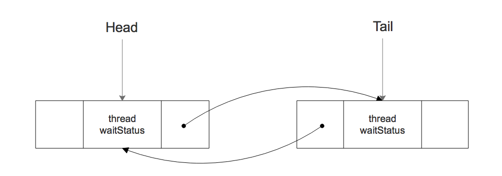
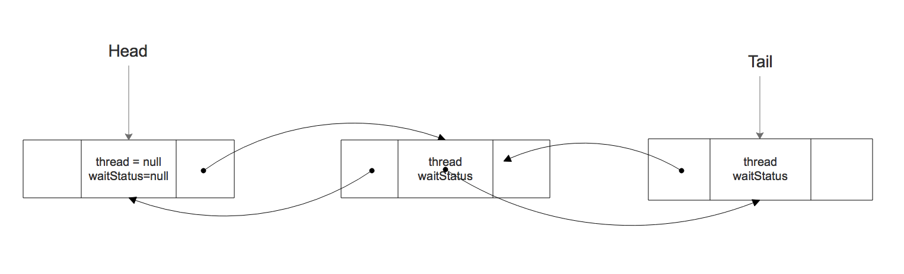

### 前言

`ReentrantLock`作为 `AQS`的实现类之一，其是基于 `CAS`实现的锁，此锁为**独占锁**，并且用一个阻塞队列来阻塞前来拿锁的线程。队列为**CLH 队列**

其使用两种策略，一种是**非公平**，一种是**公平**，默认是 **非公平锁**。在这里先讨论**非公平锁**

---

1. 先来看一下 用于阻塞线程的**CLH** 队列

   

   看一下该节点的定义：

   ```java
   static final class Node {
           volatile int waitStatus;
           volatile Node prev;
           volatile Node next;
           volatile Thread thread;
     			Node nextWaiter;
       }
   ```

   + waitStatus

     > **等待状态**
     >
     > 1. CANCELLED
     >
     >    节点由于超时或者被中断而被取消.
     >
     > 2. SIGNAL
     >
     >    节点正在被阻塞并且等待信号的到来
     >
     > 3. CONDITION
     >
     >    用于条件队列中
     >
     > 4. PROPAGATE
     >
     >    用于共享锁

   + prev **指向上一个节点**

   + next **指向下一个节点**

   + thread **表示请求锁的线程**

   + nextWaiter 

     > ​	**锁的占用模式**
     >
     > + SHARED 代表共享模式
     > + EXCLUSIVE 代表独占模式

   ---

   

2. **AbstractQueuedSynchronizer**实现锁的策略

   其使用了一个`state`字段用来表示资源

   ```java
   private volatile int state; 
   ```

   并且使用一个 `thread`字段来表示当前已经占用该资源的线程

   ```java
   volatile Thread thread;
   ```

   如果为**独占锁**，我们只需要用这两个字段来表示**资源**和**占用资源的线程**，没有得到资源的线程，这个时候我们就可以用**CLH**队列去记录它们。

   ---

   

3. 获取锁 `lock`

   ```java
    final void lock() {
      					// 利用 CAS判断状态是否为0，若为0则说明资源还没被占用则将其设置为1表示占用资源
      					// 则表示拿到锁
               if (compareAndSetState(0, 1))
                   // 拿到锁后利用CAS设置资源占有者，也就是当前线程
                   setExclusiveOwnerThread(Thread.currentThread());
               else
                   // 如果没有拿到锁，则尝试排队
                   acquire(1);
           }
   ```

   这里首先就开始尝试获取锁，如果 `state` 为 `0` 则说明资源还没有被占用，这个时候就可以获取资源，获取资源成功后就设置占用该资源的线程。

   如果资源已经被占用，则尝试排队

   ```java
   public final void acquire(int arg) {
           if (!tryAcquire(arg) && // 尝试获取锁
               acquireQueued(addWaiter(Node.EXCLUSIVE), arg)) // 加入队列
               // 中断自身, 这里是不会执行的，若执行到这里，线程就会被中断, 下面会详解
               selfInterrupt(); 
       }
   ```

   其思路很简单，尝试获取锁（公平机制和非公平机制），如果没拿到则将其加入队列，并且将线程 `park`

   当有线程释放锁的时候，则会唤醒正在队列等待的线程，并会再次调用`acquire`去获取锁，所以 `selfInterrupt`不会被执行，若被执行，那线程将被结束。（正常情况下）

   

   来下 **非公平策略**下的获取锁操作

   ```java
    final boolean nonfairTryAcquire(int acquires) {
      					// 当前线程
               final Thread current = Thread.currentThread();
      					// 先资源是否为 0
               int c = getState();
               if (c == 0) {
                 	// 占用资源，并且设置 资源占用线程，获取资源成功
                   if (compareAndSetState(0, acquires)) {
                       setExclusiveOwnerThread(current);
                       return true;
                   }
               }
      					// 资源已经被占用，无法获取资源
      					// 判断是否是当前线程占用的资源
               else if (current == getExclusiveOwnerThread()) {
                 	// 当前线程占用的资源，则资源++
                   int nextc = c + acquires;
                 	// 检测资源数是否溢出，若溢出直接报 Error
                   if (nextc < 0) // overflow
                       throw new Error("Maximum lock count exceeded");
                 	// 设置资源
                   setState(nextc);
                   return true;
               }
               return false;
           }
   ```

   这里实现很简单，也就是判断一下资源是否被占用，然后处理下那两个变量。

   值得思考的地方是，其之所以是不公平的，是因为其直接去尝试获取锁，而不去考虑队列的情况，如果是此时队列中有等待的线程，则其不会去检测队列中是否有等待的线程而主动去排队，它直接去获取锁，所以这是**不公平的策略**

   我们可以来看一下**公平锁的策略**

   ```java
   static final class FairSync extends Sync {
           private static final long serialVersionUID = -3000897897090466540L;
   
           final void lock() {
               acquire(1);
           }
   
           /**
            * Fair version of tryAcquire.  Don't grant access unless
            * recursive call or no waiters or is first.
            */
           protected final boolean tryAcquire(int acquires) {
               final Thread current = Thread.currentThread();
               int c = getState();
               if (c == 0) {
                   if (!hasQueuedPredecessors() &&
                       compareAndSetState(0, acquires)) {
                       setExclusiveOwnerThread(current);
                       return true;
                   }
               }
               else if (current == getExclusiveOwnerThread()) {
                   int nextc = c + acquires;
                   if (nextc < 0)
                       throw new Error("Maximum lock count exceeded");
                   setState(nextc);
                   return true;
               }
               return false;
           }
       }
   ```

   显然，其多了一句 `hasQueuedPredecessors`，用来判断是否有正在等待的线程。所以这就是 **公平锁**和**非公平锁**的区别。

   + 公平锁优先考虑队列中是否有正在等待的线程，如果有，则会将自身加入队列
   + 非公平锁不考虑队列中是否有正在等待的线程，而是直接去获取锁

   

   下面继续看其，如何加入队列

   ```java
     acquireQueued(addWaiter(Node.EXCLUSIVE), arg))
   ```

   首先是添加 `waiter`，这个`waiter`就是队列中的节点，因为此锁为**独占锁**，所以节点类型为 `EXCLUSIVE`

   ```java
   private Node addWaiter(Node mode) {
     			// 新建一个节点
           Node node = new Node(Thread.currentThread(), mode);
           Node pred = tail;
     			// 队列尾部不为空则直接插入
           if (pred != null) {
               node.prev = pred;
             	// 设置 tail
               if (compareAndSetTail(pred, node)) {
                   pred.next = node;
                   return node;
               }
           }
     			// 尾部为空
           enq(node);
           return node;
       }
   ```

   ```java
   private Node enq(final Node node) {
           for (;;) {
               Node t = tail;
             	// 尾部为空则直接new一个
               if (t == null) { // Must initialize
                   if (compareAndSetHead(new Node()))
                       tail = head;
               } else {
                 	// 尾部不为空则直接插入
                   node.prev = t;
                   if (compareAndSetTail(t, node)) {
                       t.next = node;
                       return t;
                   }
               }
           }
       }
   ```

   这个很简单，就判断 `tail`是否为 `null`，如果为 `null` 则直接插入一个 `空node`，否则则直接插入到 `tail`后面，并且设置 `tail`为新插入的节点。

   `enq` 方法值得注意的地方是，如果 `tail`为 `null`，其会新建一个`空node` 并且，将`node`接入到 `空node` 后面。

   如图所示：

   

   其头节点始终是空的。

   

   将节点插入到队尾后，则尝试获取锁

   ```java
   final boolean acquireQueued(final Node node, int arg) {
           boolean failed = true;
           try {
               boolean interrupted = false;
               for (;;) {
                 	// 获取当前尾节点的前一个节点
                   final Node p = node.predecessor();
                 	// 如果队头，并且尝试获取锁
                   if (p == head && tryAcquire(arg)) {
                     	// 如果拿到锁，则设置node 为头部
                       // 记住 头部节点作废的。
                       setHead(node);
                       p.next = null; // help GC
                       failed = false;
                       return interrupted;
                   }
                 // 判断节点信号是否为SIGNAL 如果为 此信号说明该节点正在等待信号，则将其 park
                   if (shouldParkAfterFailedAcquire(p, node) &&
                       parkAndCheckInterrupt()) // park 线程
                       interrupted = true;
               }
           } finally {
               if (failed)
                   cancelAcquire(node);
           }
       }
   ```

   首先其死循环，获取`node` 的前一个节点 `p`，然后判断 `p`是否为 `head`头节点，如果为 `head`，因为头节点是无效的，所以这个时候队列中只有一个线程在排队，也就是有两个节点，此时若能获取到锁，则将`p.next= null`，并且设置 `node 为 head`，此时队列只有一个节点，这个节点是作废的。

   因为队列为空的时候，它会一次性添加两个节点，每次拿到锁它会作废掉头节点，这个到 `release` 锁的时候就看出来了。

   调用 `shouldParkAfterFailedAcquire`，设置 `p`的信号为 `SIGNAL` 然后 `parkAndCheckInterrupt`让线程 `park`

   ```java
   private static boolean shouldParkAfterFailedAcquire(Node pred, Node node) {
           int ws = pred.waitStatus;
     			// p为SIGNAL 则直接返回true，就会调用 park掉线程
           if (ws == Node.SIGNAL)
               return true;
           if (ws > 0) {
               // 在这里跳过已经被取消的线程，超时或者被中断 都会被标记为 取消状态
               do {
                   node.prev = pred = pred.prev;
               } while (pred.waitStatus > 0);
               pred.next = node;
           } else {
             	// 若p不为SIGNAL 则设置其状态为 SIGNAL
               compareAndSetWaitStatus(pred, ws, Node.SIGNAL);
           }
           return false;
       }
   ```

   ```java
   private final boolean parkAndCheckInterrupt() {
     			// LockSupport 支持
           LockSupport.park(this);
           return Thread.interrupted();
       }
   ```

   至此，获取锁就完毕了。

4. 下面来看 `unlock`

   ```java
      public void unlock() {
           sync.release(1);
       }
   ```

   ```java
   public final boolean release(int arg) {
     			// 释放锁
           if (tryRelease(arg)) {
               Node h = head;
             	// 然后判断 队列头部是否存在需要唤醒的节点
               if (h != null && h.waitStatus != 0)
                   // 若存在节点则直接唤醒
                   unparkSuccessor(h);
               return true;
           }
           return false;
       }
   ```

   释放锁很简单，首先是`tryRelease` 尝试去释放资源，如果释放资源成功，则从队头开始唤醒正在阻塞的线程。

   ```java
   protected final boolean tryRelease(int releases) {
               int c = getState() - releases;
     					// 获取锁的线程必须和释放锁的线程一样，这没什么毛病，否则其它线程也能释放锁，那就违反其设计了 
               if (Thread.currentThread() != getExclusiveOwnerThread())
                   throw new IllegalMonitorStateException();
               boolean free = false;
     					// c 为 资源，因为一个线程拿到锁后还可以再获取锁，state就会++，所以释放锁的时候要对应
     					// c 为 0的时候才能释放锁
               if (c == 0) {
                   free = true;
                 	// 释放占用线程
                   setExclusiveOwnerThread(null);
               }
     					// 设置 资源
               setState(c);
               return free;
           }
   ```

   + 释放锁的线程必须要和获取锁的线程一样
   + 并且`lock` 和 `unlock` 调用次数要一样
   +  state 为 0 ，则设置 thread 为 null 则为释放资源成功

   下面看下其如何唤醒线程

   ```java
   private void unparkSuccessor(Node node) {
   
       int ws = node.waitStatus;
     	// 设置等待状态为 0
       if (ws < 0)
           compareAndSetWaitStatus(node, ws, 0);
   		
     // 头节点是作废的，所以直接拿其下一个节点
       Node s = node.next;
     	// 跳过取消的节点, 找到未取消的节点
       if (s == null || s.waitStatus > 0) {
           s = null;
           for (Node t = tail; t != null && t != node; t = t.prev)
               if (t.waitStatus <= 0)
                   s = t;
       }
     	// 调用 unpark唤醒线程
       if (s != null)
           LockSupport.unpark(s.thread);
   }
   ```

   + 先设置节点等待状态为 0
   + 跳过取消的节点，或者 状态为 0的节点，之所以要这样，因为释放锁的时候我们并不会删除节点，我们只是将其等待状态设置为0，这个时候我们就可以跳过这些节点，从后继节点中继续寻找到 已经阻塞的节点
   + 调用 unpark 唤醒线程


