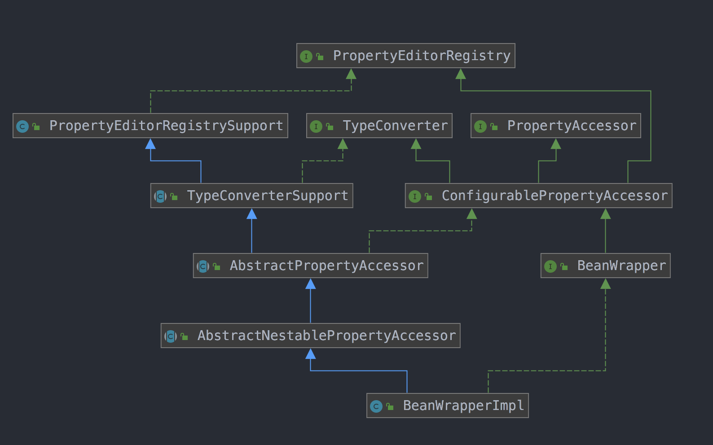
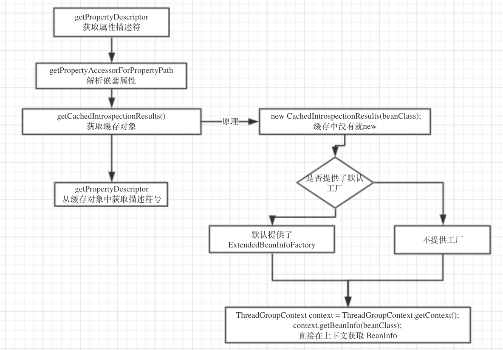

### 1.前言

为什么先从对bean的包装开始阅读源码呢，因为beans包的核心就是`BeanFactory` 🐶，其作用就是对bean进行管理，那么对bean管理的前提就是对bean进行解析，然后支持属性的`set` 或 `get` 操作。那么我们列举一下`BeanFactory`的主要职责，即使没阅读过源码，也应该知道个大概过程.

+ 解析`xml`或者其它配置文件得到 `BeanDefinition`
+ 实例化 `Instance`
+ `AutoWired`自动装配 `Bean`的依赖

**所以，我们先了解如何去得到一个Bean的 “定义” (解析xml那部分先不讲)**

### 2. BeanWrapper接口

```tex
这个类的主要作用是解析`Class` 然后获取属性，进一步封装，然后提供修改属性的接口
```

```java
public interface BeanWrapper extends ConfigurablePropertyAccessor {
  // 设置集合属性自增长的长度
	void setAutoGrowCollectionLimit(int autoGrowCollectionLimit);
	
  // 获取当前集合属性自增长的长度
	int getAutoGrowCollectionLimit();
	
	// 获取包装的Bean的Instance
	Object getWrappedInstance();
	
	// 获取Bean的Class
	Class<?> getWrappedClass();
	
	// 获取所有属性描述符
	PropertyDescriptor[] getPropertyDescriptors();
  
  // 获取属性描述符
	PropertyDescriptor getPropertyDescriptor(String propertyName) throws InvalidPropertyException;

}
```


为什么上面会涉及到**集合**，因为`Bean` 支持`nested (嵌套)` 属性读写，也就是`pojo`

```properties
bean.setValue("bean.child.attr", 1)
```

### 3. `BeanWrapperImpl实现`

1. 我们从其测试代码中可以看到这样的用法

   

   ```java
   GetterBean target = new GetterBean();
   BeanWrapper accessor = createAccessor(target);
   accessor.setPropertyValue("name", "tom");
   assertThat(target.getAliasedName()).isEqualTo("tom");
   assertThat(accessor.getPropertyValue("aliasedName")).isEqualTo("tom");
   ```

   ```java
   protected BeanWrapperImpl createAccessor(Object target) {
   		return new BeanWrapperImpl(target);
   	}
   ```

   我们可以看到 `createAccessor` 就是`new BeanWrapperImpl`就完成对`Bean`的封装了， 就可以调用

   - `setPropertyValue`  设置属性值
   - `getPropertyValue`  获取属性值

2. 初步看下 `BeanWrapperImpl`的`UML` (不用纠结 `UML` 后面会人肉其运行过程) :happy:

   

   

   
   
   **在上面这个图中，着重 `AbstractNesablePropertyAccessor`** 此类是用于支持上文提到的`Nested` 嵌套属性读写.
   
3. `getPropertyDescriptor` 获取属性描述符

   ```java
   public PropertyDescriptor getPropertyDescriptor(String propertyName) throws InvalidPropertyException {
   		// [1] 先解析嵌套属性，获取最后一个属性的Instance
   		BeanWrapperImpl nestedBw = (BeanWrapperImpl) getPropertyAccessorForPropertyPath(propertyName);
   		String finalPath = getFinalPath(nestedBw, propertyName);
   		// [2] 然后直接获取属性描述符
   		PropertyDescriptor pd = nestedBw.getCachedIntrospectionResults().getPropertyDescriptor(finalPath);
   		if (pd == null) {
   			throw new InvalidPropertyException(getRootClass(), getNestedPath() + propertyName,
   					"No property '" + propertyName + "' found");
   		}
   		return pd;
   	}
   ```

   + 刚才我们说过其支持`nested` 嵌套属性，如果我们传入的`propertyName` 为 `bean.child.name` ，我们就要先拿到 `bean` 然后再拿到 `child` 最后拿到 `name` 然后才能返回类型描述符. ​ :warning: 第一步我们先不管

   + 然后第二步 `getCachedIntrospectionResults#getPropertyDescriptor()` 来获取属性描述符

   + `CachedIntrospectionResults` 中包含 `PropertyDescriptor` 信息，跟下去

     

     ```java
     private CachedIntrospectionResults getCachedIntrospectionResults() {
        	// [1] 判断是不是有缓存了
     		if (this.cachedIntrospectionResults == null) {
           // [2] 缓存中没有那就 new
     			this.cachedIntrospectionResults = CachedIntrospectionResults.forClass(getWrappedClass());
     		}
     		return this.cachedIntrospectionResults;
     	}
     ```

     继续跟。

     ```java
     static CachedIntrospectionResults forClass(Class<?> beanClass) throws BeansException {
     		// [1] 从一级缓存中获取
     		CachedIntrospectionResults results = strongClassCache.get(beanClass);
     		if (results != null) {
     			return results;
     		}
     
     		// [2] 从二级缓存中获取
     		results = softClassCache.get(beanClass);
     		if (results != null) {
     			return results;
     		}
     
     		// [3] 如果都没有，则New一个, 核心还是在这
     		results = new CachedIntrospectionResults(beanClass);
     		ConcurrentMap<Class<?>, CachedIntrospectionResults> classCacheToUse;
     
     		// [4] 判断使用一级缓存还是二级缓存
     		// 经调试，发现spring用的是一级缓存
     		if (ClassUtils.isCacheSafe(beanClass, CachedIntrospectionResults.class.getClassLoader()) ||
     				isClassLoaderAccepted(beanClass.getClassLoader())) {
     			classCacheToUse = strongClassCache;
     		}
     		else {
     			if (logger.isDebugEnabled()) {
     				logger.debug("Not strongly caching class [" + beanClass.getName() + "] because it is not cache-safe");
     			}
     			classCacheToUse = softClassCache;
     		}
     
     		// [5] 将新New的放入缓存
     		CachedIntrospectionResults existing = classCacheToUse.putIfAbsent(beanClass, results);
     		return (existing != null ? existing : results);
     	}
     ```

     可以看到`spring` 很善用缓存，这里可以看到，其用了两个缓存 `strongClassCache` 和 `softClassCache`

     ```java
       /* [DESC] 一级缓存*/
     	static final ConcurrentMap<Class<?>, CachedIntrospectionResults> strongClassCache =
     			new ConcurrentHashMap<>(64);
     
     	/* [DESC] 二级缓存 又称为 SoftCache，因为采用弱引用MAP，所以缓存元素长时间未使用则会被回收*/
     	static final ConcurrentMap<Class<?>, CachedIntrospectionResults> softClassCache =
     			new ConcurrentReferenceHashMap<>(64);
     ```

     **虽然其设置了两层缓存，但实际只用到了 `strongClassCache`** 因为属性这些会常驻内存，所以不需要使用弱引用的`Map`,实际上控制使用那个缓存是`isCacheSafe` 来控制的, 继续跟 :hammer:我是最强人肉王子

     ```java
     public static boolean isCacheSafe(Class<?> clazz, @Nullable ClassLoader classLoader) {
        Assert.notNull(clazz, "Class must not be null");
        try {
           // [1] 获取该类的ClassLoader
           ClassLoader target = clazz.getClassLoader();
           // Common cases
     
           // [2] 如果目标类的ClassLoader == 提供的classLoader
           // [NOTICE] 双亲委派原则，只有使用同一个类加载器，加载的数据才能是只有一份，这个缓存才是是有效的
           if (target == classLoader || target == null) {
              return true;
           }
           if (classLoader == null) {
              return false;
           }
           // [3] 递归classLoader的祖先
           // Check for match in ancestors -> positive
           ClassLoader current = classLoader;
           while (current != null) {
              current = current.getParent();
              if (current == target) {
                 return true;
              }
           }
           
           // [4] 递归目标的祖先
           // Check for match in children -> negative
           while (target != null) {
              target = target.getParent();
              if (target == classLoader) {
                 return false;
              }
           }
        }
        catch (SecurityException ex) {
           // Fall through to loadable check below
        }
     
        // Fallback for ClassLoaders without parent/child relationship:
        // safe if same Class can be loaded from given ClassLoader
        return (classLoader != null && isLoadable(clazz, classLoader));
     }
     ```

     **这里判断cache是否安全的原理是** ，根据`双亲委派` 机制，因为一个类被一个加载器加载一次在内存中就会有一份`Class` , 如果它们的加载器是一样的，那么得到的`Class` 也是一致的，这样才能确保，我们拿到的目标`Class` 数据是正确的。

     解析完这个，我们继续上面的，如果从缓存拿不到则 `new`

     ```java
     results = new CachedIntrospectionResults(beanClass);
     ```

     ```java
     private CachedIntrospectionResults(Class<?> beanClass) throws BeansException {
     		try {
     			if (logger.isTraceEnabled()) {
     				logger.trace("Getting BeanInfo for class [" + beanClass.getName() + "]");
     			}
     			// 关注 #getBeanInfo
     			this.beanInfo = getBeanInfo(beanClass);
     ```

     ```java
     private static BeanInfo getBeanInfo(Class<?> beanClass) throws IntrospectionException {
        // [1] 尝试从加载的工厂中获取BeanInfo
        // 实际上，spring.beans 只提供一个工厂，而且那个工厂也是从线程上下文中获取
        // 所以一定能拿到，这是为了防止spring.beans没有提供工厂而考虑到的细节
        for (BeanInfoFactory beanInfoFactory : beanInfoFactories) {
           BeanInfo beanInfo = beanInfoFactory.getBeanInfo(beanClass);
           if (beanInfo != null) {
              return beanInfo;
           }
        }
     
        // [2] 如果不提供工厂或者工厂不存在，直接在线程上下文中获取
        return (shouldIntrospectorIgnoreBeaninfoClasses ?
              Introspector.getBeanInfo(beanClass, Introspector.IGNORE_ALL_BEANINFO) :
              Introspector.getBeanInfo(beanClass));
     }
     ```

     在`CachedIntrospectionResults` 中，它会加载一个 `factory`

     ```java
     /** [DESC]  在这里加载BeanInfoFactory*/
     // 加载 "META-INF/spring.factories" 中指定的工厂类
     private static List<BeanInfoFactory> beanInfoFactories = SpringFactoriesLoader.loadFactories(
           BeanInfoFactory.class, CachedIntrospectionResults.class.getClassLoader());
     ```

     ```properties
     org.springframework.beans.BeanInfoFactory=org.springframework.beans.ExtendedBeanInfoFactory
     ```

     发现了，它的默认工厂类是 `ExtendedBeanInfoFactory`

     接下来继续看，如果工厂类中不存在 `BeanInfo`则会调用 `Introspector#getBeanInfo()`

     ```java
     public static BeanInfo getBeanInfo(Class<?> beanClass)
             throws IntrospectionException
         {
             if (!ReflectUtil.isPackageAccessible(beanClass)) {
                 return (new Introspector(beanClass, null, USE_ALL_BEANINFO)).getBeanInfo();
             }
       			// 从线程上下文获取已经加载的 Class 信息
             ThreadGroupContext context = ThreadGroupContext.getContext();
             BeanInfo beanInfo;
             synchronized (declaredMethodCache) {
                 beanInfo = context.getBeanInfo(beanClass);
             }
             if (beanInfo == null) {
                 beanInfo = new Introspector(beanClass, null, USE_ALL_BEANINFO).getBeanInfo();
                 synchronized (declaredMethodCache) {
                     context.putBeanInfo(beanClass, beanInfo);
                 }
             }
             return beanInfo;
         }
     ```

     到此就不用追了，这里已经是jdk了，实际上是从 `线程上下文`获取的 `BeanInfo` ，这也证明了 `BeanFactory` 用的是 `线程上下文加载器` 

     **其实上面的 默认工厂 ExtendedBeanInfoFactory** 用的也是`上下文加载器`

     ```java
     public class ExtendedBeanInfoFactory implements BeanInfoFactory, Ordered {
     
        /**
         * Return an {@link ExtendedBeanInfo} for the given bean class, if applicable.
         */
        @Override
        @Nullable
        public BeanInfo getBeanInfo(Class<?> beanClass) throws IntrospectionException {
           return (supports(beanClass) ? new ExtendedBeanInfo(Introspector.getBeanInfo(beanClass)) : null);
        }
     ```

     **总结下，以免跟得太深，回溯不了**

     

     

     **目前为止，我们也只是拿到了 `BeanInfo`**

     回到 `new CachedIntrospectionResults` 的地方，我们首先已经有了 `BeanInfo`

     ```java
     private CachedIntrospectionResults(Class<?> beanClass) throws BeansException {
        try {
           // 关注 #getBeanInfo
           this.beanInfo = getBeanInfo(beanClass);
     
           this.propertyDescriptorCache = new LinkedHashMap<>();
     
           // [1] 直接获取BeanInfo的 {@link PropertyDescriptor}
           PropertyDescriptor[] pds = this.beanInfo.getPropertyDescriptors();
           for (PropertyDescriptor pd : pds) {
              // [2] 某些属性是被保护的，则跳过
              if (Class.class == beanClass &&
                    ("classLoader".equals(pd.getName()) ||  "protectionDomain".equals(pd.getName()))) {
                 continue;
              }
              // [3] 将{@link PropertyDescriptor} 转换为 {@link GenericTypeAwarePropertyDescriptor}
              pd = buildGenericTypeAwarePropertyDescriptor(beanClass, pd);
              // [4] 丢入缓存
              this.propertyDescriptorCache.put(pd.getName(), pd);
           }
     
           // [5] 还得判断这些方法是不是java8的接口的默认方法
           Class<?> currClass = beanClass;
           while (currClass != null && currClass != Object.class) {
              introspectInterfaces(beanClass, currClass);
              currClass = currClass.getSuperclass();
           }
           this.typeDescriptorCache = new ConcurrentReferenceHashMap<>();
        }
        
     }
     ```

     直接从 `BeanInfo` 拿到属性描述符，并且缓存起来，现在我们就完成了获取 `BeanInfo` 部分了，那么剩下的就是根据拿到的 `PropertyDescriptor` 去读写 `Property` :wink:

   


