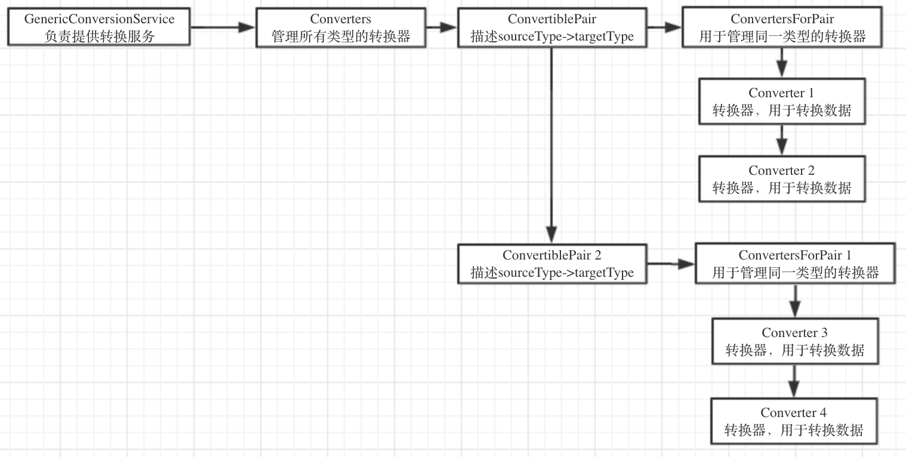
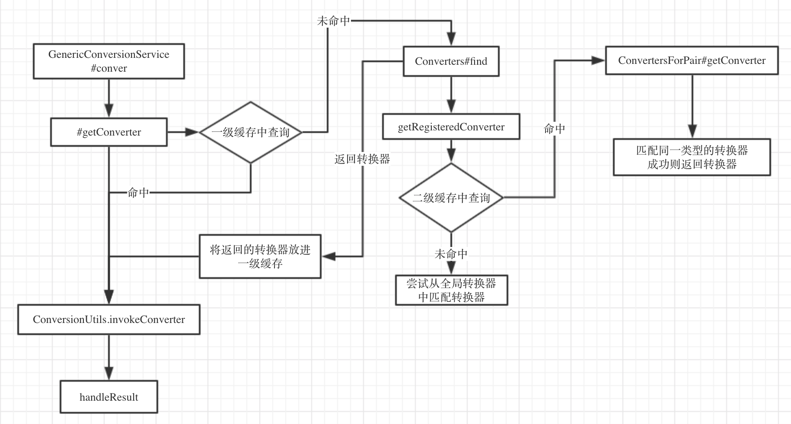

### 前言

因为分开每一个类理解是很难理解其设计，所以需要总结，分析各个类的义务，组合起来就是整个类型转换服务的功能. 先看一张结构图。



+ `ConvertiblePair` 用于描述类型转换信息

  ```java
  final class ConvertiblePair {
  		private final Class<?> sourceType;
  		private final Class<?> targetType;
  	}
  ```

  

+ `Converter` 用于转换数据

  ```java
  public interface GenericConverter {
  	// 获取描述信息
  	Set<ConvertiblePair> getConvertibleTypes();
  
  	// 数据转换
  	Object convert(@Nullable Object source, TypeDescriptor sourceType, TypeDescriptor targetType);
  }
  
  ```

  

+ `ConvertersForPair` 用于管理同一个类型的所有的`Converter`

  ```java
  private static class ConvertersForPair {
  	 // 存放同一类型的转换器
  		private final LinkedList<GenericConverter> converters = new LinkedList<>();
      // 添加转换器
  		public void add(GenericConverter converter);
  
  		// 匹配并且获取转换器
  		public GenericConverter getConverter(TypeDescriptor sourceType, TypeDescriptor targetType);
  	}
  ```

  

+ `Converters` 用于管理所有类型的转换器

  ```java
  private static class Converters {
  		// 存放全局转换器, 未知转换类型的转换器
  		private final Set<GenericConverter> globalConverters = new LinkedHashSet<>();
  
  		// 用作缓存，快速查询转换器
  		private final Map<ConvertiblePair, ConvertersForPair> converters = new LinkedHashMap<>(36);
  
  		/**
  		 * [DESC] 添加转换器
  		 * @param converter 需要添加的转换器
  		 */
  		public void add(GenericConverter converter);
    
  	  // 查询转换器
  		public GenericConverter find(TypeDescriptor sourceType, TypeDescriptor targetType);
  		
  		// 匹配已经注册的转换器
  		private GenericConverter getRegisteredConverter(TypeDescriptor sourceType,
  				TypeDescriptor targetType, ConvertiblePair convertiblePair);
  		}
  	}
  
  ```

  

+ `GenericCOnversionService` 负责调度这些转换器从而提供转换服务

  ```java
  public class GenericConversionService implements ConfigurableConversionService {
  
  	// 转换器管理类，用于管理所有的转换器
  	private final Converters converters = new Converters();
  
  	// 用于缓存 source->target 的转换器
  	private final Map<ConverterCacheKey, GenericConverter> converterCache = new ConcurrentReferenceHashMap<>(64);
  
  	
  	// 添加转换器
  	public void addConverter(Converter<?, ?> converter);
    
    // 提供转换的业务
  	public <T> T convert(@Nullable Object source, Class<T> targetType);
  
  	// 获取转换器
  	protected GenericConverter getConverter(TypeDescriptor sourceType, TypeDescriptor targetType)
  ```

  这一下子就清楚了，其核心就是围绕 `匹配转换器/find转换器` 而实现的

  因为具体的转换的逻辑是采用`策略设计模式`, 讨论具体框架的时候根本不用管

  下面来看一张具体的流程图。

  

  

  将此图链接上顶部的结构图，就一目了然，想要找到 `Converter` 就得先找到 `ConvertsOfPair` 然后在 其内部匹配转换器, 若在 `ConvertersOfPair` 中没有，则会在 `Converters` 管理的全局转换器中匹配

  有了这些，再返回第一节看源码，一定很清晰.