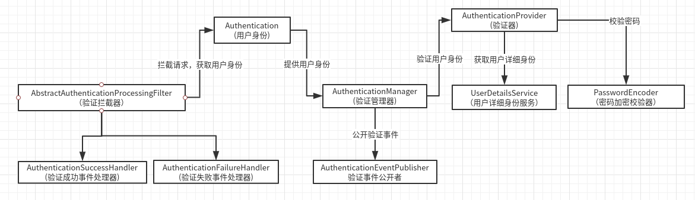

### spring security 组件解析 

1. Authentication （用户身份）

   > 在 spring security 里，用户身份在不同阶段有着不同的含义
   >
   > + 在校验开始时，用户身份代表用户输入的用户信息，比如账号、密码、验证码
   > + 在校验成功后，用户身份代表用户的真实信息，比如账号、密码、权限
   >
   > ---
   >
   > 
   >
   > `Authentication` 接口则是 `security` 提供的用户身份接口，实现类有常用的 `UsernamePasswordAuthenticationToken`, 这个接口其包含的最基本的信息如下
   >
   > + authorities 
   >
   >   用户身份所拥有的所有权限
   >
   > + principal 
   >
   >   其代表用户的唯一标识，在校验开始阶段其表示`账号` ，在校验成功后其表示 `UserDetails` 也就是用户细节
   >
   > + credentials 
   >
   >   其代表用户凭证，通常是密码
   >
   > + details
   >
   >   其代表细节部分, 默认是**SessionID和IP**， 当然如果要做成验证码, 这里我们也可以自定义

2. AuthenticationManager (验证器管理器)

   > 验证器管理器的作用仅仅时用来管理验证器而已，真正的验证功能还是靠验证器来实现
   >
   > 该管理器的默认实现类是 `ProviderManager`
   >
   > 其主要负责管理以下组件: 
   >
   > + AuthenticationEventPublisher 
   >
   >   验证事件公开者，当验证成功或者失败，其会将此类事件公开，如果我们设置了对应事件的 Handler 那我们就可以监听该类事件，比如说**登录成功事件 或 登录失败事件**
   >
   > + AuthenticationProvider 
   >
   >   身份校验器提供者，也就是身份校验器，用于校验用户身份
   >
   > 这个管理器还有一个 `parent` 字段，意味其类似于一个链表，和 `spring beanFactory` 有点相似

3. AuthenticationEventPublisher

   > 验证事件公开者, 当验证成功或者失败，其会将此类事件公开, 可以看下它的接口
   >
   > ```java
   > public interface AuthenticationEventPublisher {
   > 	
   >     // 验证成功事件
   > 	void publishAuthenticationSuccess(Authentication authentication);
   > 	
   >     // 验证失败事件
   > 	void publishAuthenticationFailure(AuthenticationException exception,
   > 			Authentication authentication);
   > }
   > 
   > ```
   >
   > 它的默认实现类是 `DefaultAuthenticationEventPublisher`, 里面多了一个  `ApplicationEventPublisher` 这个是 `spring` 的事件公开者， 默认只是将这个事件公开给 `spring` 上下文
   >
   > `security` 校验事件，有专门的事件处理器去处理
   >
   > + AuthenticationSuccessHandler
   > + AuthenticationFailureHandler

4. AuthenticationProvider

   > 身份验证提供者，也就是身份校验器,  其有两个方法
   >
   > ```java
   > public interface AuthenticationProvider {
   > 	Authentication authenticate(Authentication authentication)
   > 			throws AuthenticationException;
   > 
   > 	boolean supports(Class<?> authentication);
   > }
   > ```
   >
   > - authenticate 
   >
   >   这个方法作用就是用来校验用户信息的，它的返回值和参数是一样的，这就是为什么说用户身份这个东西在校验开始和校验成功后代表的含义是不一样的原因。
   >
   > - supports
   >
   >   用户返回我们的校验器是否支持此类用户身份
   >
   > 该接口的默认实现类是 
   >
   > `AbstractUserDetailsAuthenticationProvider` 其封装了基本的验证逻辑 
   >
   > `DaoAuthenticationProvider` 默认的校验器

5. PasswordEncoder

   > 密码加密和校验器，用于加密和校验密码，暂且看下它的接口
   >
   > ```java
   > public interface PasswordEncoder {
   > 
   > 	String encode(CharSequence rawPassword);
   > 
   > 	boolean matches(CharSequence rawPassword, String encodedPassword);
   > 
   > 	default boolean upgradeEncoding(String encodedPassword) {
   > 		return false;
   > 	}
   > }
   > ```
   >
   > + encode 
   >
   >   用于加密密码，算法可以自定义
   >
   > + matches
   >
   >   用户校验密码
   >
   > + upgradeEncoding
   >
   >   用户更新密码
   >
   > 
   > 默认的实现类是 `BCryptPasswordEncoder`

6. UserDetailsService

   > 该服务接口用于拿到用户的身份信息，一般从数据库和内存中获取，这个服务提供给 `AuthenticationProvider` 使用
   >
   > 其只有一个接口
   >
   > ```java
   > UserDetails loadUserByUsername(String username) throws UsernameNotFoundException;
   > ```
   >
   > 其中 `UserDetails` 接口包含了用户的身份信息
   >
   > ```java
   > public interface UserDetails extends Serializable {
   > 	// 用户的权限
   > 	Collection<? extends GrantedAuthority> getAuthorities();
   > 	
   >     // 用户密码
   > 	String getPassword();
   > 
   > 	// 用户名
   > 	String getUsername();
   > 
   > 	// 账号未过期
   > 	boolean isAccountNonExpired();
   > 
   > 	// 账号未被锁定
   > 	boolean isAccountNonLocked();
   > 
   > 	// 账号密码已过期
   > 	boolean isCredentialsNonExpired();
   > 
   > 	// 账号启用
   > 	boolean isEnabled();
   > }
   > 
   > ```
   >
   > 

7. AbstractAuthenticationProcessingFilter 

   > 万物基于 `Filter` 这句话没毛病，`spring security` 也如此，这个类贯穿了整个 `sprign security` 的验证过程
   >
   > 它有一个重要的参数: 
   >
   > ```java
   > public void setFilterProcessesUrl(String filterProcessesUrl)
   > ```
   >
   > 这个 `URL` 是用于指定身份验证的`URL`，当拦截器拦截到这个地址时，`spring security` 就会从里面拿到用户信息然后进行身份验证。
   >
   > 

8. 组件依赖关系

   

   

   

   

